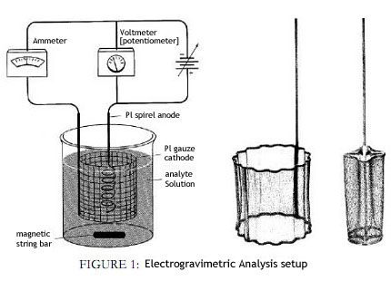

## Theory 

In gravimetric analysis, determination of metal concentration depends on the weighing process of the metal. But in electrogravimetry, the metal concentration is determined by using electrochemistry. It is an easy and accurate method. The electrogravimetric analysis is done by depositing the metal (whose concentration is to be determined) on a pre-weighed electrode, and the concentration can be calculated from the weight gained by that electrode.

For example, determination of copper is the most important application of electrogravimetry. The whole process is carried out in an electrolytic cell, which consists of two electrodes: an anode and a cathode, with an external electrical energy supply. On the cathode, deposition of the metal takes place due to the reduction of the metal, and it is connected to the –ve terminal of the energy source. On the anode, oxidation occurs, and it is connected to the +ve terminal of the energy source.

Nowadays, one of the electrodes is used as a stirrer for stirring the analyte solution. Fisher electrodes are used in this process.

 

<h2>Types of Electrogravimetric Analysis</h2>

There are two types of electrogravimetric methods:

<h3>1. Constant Current Electrolysis:</h3>

In this process, the current is kept constant, and the potential is increased. Here, no control of the potential of the working electrode is exercised, and the applied cell potential is held at a more or less constant level but provides a large enough current to complete the electrolysis in a reasonable length of time.
A fixed amount of current can pass between the anode and cathode. The limitation of constant current electrolysis is that it cannot be used for the separation of ions in a solution containing multiple species.

<h3>2. Constant Potential Electrolysis:</h3>

The simplest way of performing analytical electrolysis is to maintain the applied cell potential at a constant value. It is more often used in the separation of components from a mixture in which the decomposition potentials are not widely separated.

For example, the determination of copper from an acidic solution (either nitric acid or sulphuric acid or a mixture of the two) at constant current. Suppose an EMF of 2–3 V is applied, then the reactions are:

<ul>
  <li><strong>At cathode:</strong> 
    Cu2+ + 2e- → Cu 
    2H+ + 2e- → H2
  </li>
  <li><strong>At anode:</strong> 
    4OH- → O2 + 2H2O + 4e-
  </li>
</ul>

Electrodeposition is governed by Ohm's Law and Faraday's Laws of Electrolysis.

<h3>Ohm's Law:</h3>

The relation between current (I), voltage (V), and resistance (R) is:

<strong>I = V / R</strong>

<h3>Faraday's First Law:</h3>

The amount of substance liberated at an electrode is directly proportional to the quantity of electricity (Q) passed through the electrolyte:

<strong>m ∝ Q</strong> &nbsp; or &nbsp; <strong>m = z × Q</strong>

Since <strong>Q = I × t</strong>, we get:

<strong>m = z × I × t</strong>

<ul>
  <li><strong>m</strong> = mass of the substance liberated</li>
  <li><strong>z</strong> = electrochemical equivalent</li>
  <li><strong>I</strong> = current in amperes</li>
  <li><strong>t</strong> = time in seconds</li>
</ul>

<h3>Faraday's Second Law:</h3>

The mass of substances liberated is directly proportional to their equivalent weights, at the same quantity of electricity.

  <strong>(m1 / z1) = (m2 / z2)</strong>

<h2>Instrumentation</h2>

The apparatus for analytical electro-deposition without cathode potential control consists of a suitable cell and a direct current supply. The voltage applied to the cell is controlled by a variable resistance (R). A current meter and a voltmeter indicate the approximate current and voltage. The voltage is maintained at the initial level until the deposition is judged complete.

<h2>Applications</h2>
<ul>
  <li>Used for accurate and precise determination of concentrations of chemical elements in quantitative analysis.</li>
  <li>Different species in a solution can be separated by selectively plating and removing them.</li>
  <li>Used in electrochemical methods for removing interferences.</li>
  <li>Used in organic synthesis for conducting oxidation or reduction reactions.</li>
</ul>
